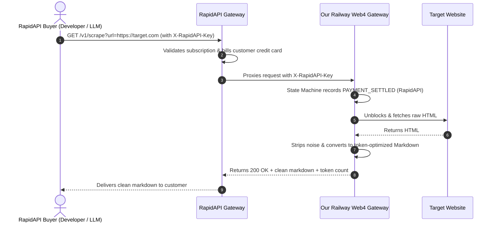

# 🚀 RapidAPI Listing Package — Web 4.0 AI Scraper & Unblocker

This package allows you to list our **Web 4.0 Scraper Gateway** on RapidAPI in under **2 minutes**, enabling automated credit card subscriptions and instant billing for developers, LLM builders, and AI agents worldwide.

---

## ⚡ 1-Click Import Instructions (RapidAPI Studio)

1. Go to **[RapidAPI Studio](https://rapidapi.com/studio)** (log in or create a free publisher account).
2. Click **Add New API** (top right) $\rightarrow$ Choose **Import from OpenAPI / Swagger**.
3. Choose **Import via URL** and paste our live Railway spec:
   ```text
   https://web4-agent-gateway-production.up.railway.app/openapi.json
   ```
   *(Or click **Upload File** and select [`rapidapi_spec.json`](file:///Users/dvnmarketingstudios/.gemini/antigravity-ide/scratch/web4-agent-gateway/rapidapi_spec.json) from this folder).*
4. Set Target Base URL:
   ```text
   https://web4-agent-gateway-production.up.railway.app
   ```
5. Click **Import**! All endpoints (`/v1/scrape`, `/v1/memecoin/alpha`, `/v1/health`), parameters, and documentation will populate instantly.

---

## 📝 API Details for RapidAPI Directory

* **API Name:** `Web 4.0 AI Web Scraper & LLM Markdown Unblocker`
* **Short Description:** `High-speed bot-unblocking scraper that converts any webpage into clean, token-optimized Markdown for AI agents and LLMs.`
* **Category:** `Web Scraping` (or `Artificial Intelligence`)
* **Website:** `https://web4-agent-gateway-production.up.railway.app`
* **Terms of Service:** `https://web4-agent-gateway-production.up.railway.app/v1/terms`

---

## 💰 Recommended Pricing Plans (Configure in RapidAPI 'Plans & Pricing')

RapidAPI handles automated credit card billing, subscriptions, refunds, and payouts directly to your bank/PayPal/Stripe.

| Plan | Monthly Price | Included Requests | Overage Fee | Rate Limit |
| :--- | :--- | :--- | :--- | :--- |
| **Basic (Free Tier)** | **$0.00 / mo** | 50 requests/mo | None (Hard Cap) | 5 req / min |
| **Pro (Starter)** | **$19.00 / mo** | 2,500 requests/mo | $0.010 / request | 60 req / min |
| **Ultra (Growth)** | **$79.00 / mo** | 15,000 requests/mo | $0.007 / request | 300 req / min |
| **Mega (Enterprise)** | **$249.00 / mo** | 60,000 requests/mo | $0.005 / request | 1,000 req / min |

> [!TIP]
> **Profit Margin:** Because our scraper runs lightweight headless HTTP unblocking on our Railway server with low server overhead, each $19–$79 subscription is **>90% net profit**.

---

## 🛠️ How Calls Work End-to-End



---

## 🌐 Public Testing & Documentation Links

* **Interactive API Reference (Scalar):** [https://web4-agent-gateway-production.up.railway.app/docs](https://web4-agent-gateway-production.up.railway.app/docs)
* **Swagger UI:** [https://web4-agent-gateway-production.up.railway.app/docs/swagger](https://web4-agent-gateway-production.up.railway.app/docs/swagger)
* **Raw OpenAPI 3.1 Spec:** [https://web4-agent-gateway-production.up.railway.app/openapi.json](https://web4-agent-gateway-production.up.railway.app/openapi.json)
* **Web 4.0 Dashboard:** [https://web4-agent-gateway-production.up.railway.app/](https://web4-agent-gateway-production.up.railway.app/)
